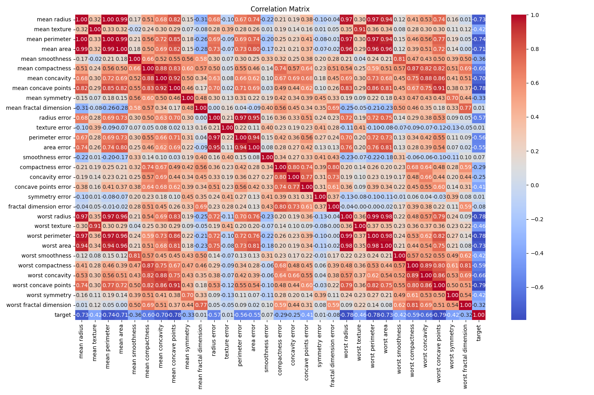
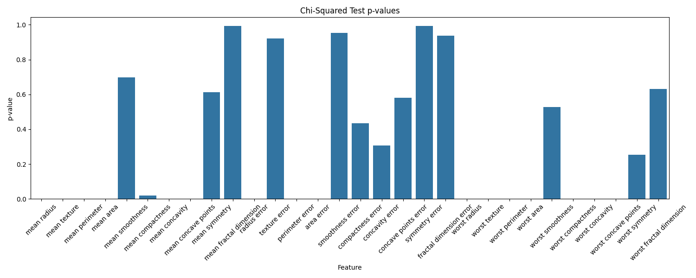
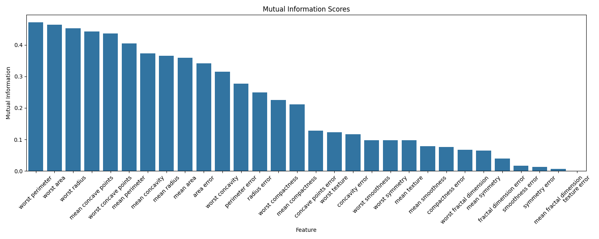

# Breast Cancer Classification

This project analyzes the Breast Cancer dataset using various feature selection techniques and evaluates model performance with and without feature selection.

## Table of Contents
- [Introduction](#introduction)
- [Dataset Overview](#dataset-overview)
- [Feature Selection Techniques](#feature-selection-techniques)
  - [1. Correlation Coefficient (Pearson)](#1-correlation-coefficient-pearson)
  - [2. Chi-Squared Test](#2-chi-squared-test)
  - [3. Mutual Information](#3-mutual-information)
- [Model Performance](#model-performance)
  - [1. Model with All Features](#1-model-with-all-features)
  - [2. Model After Feature Selection](#2-model-after-feature-selection)
- [Conclusion](#conclusion)

## Introduction

This project aims to analyze the Breast Cancer dataset using different feature selection methods and assess the impact on model performance. 

## Dataset Overview

The dataset used in this analysis is the Breast Cancer Wisconsin dataset, which consists of various features related to the characteristics of cancer tumors.

```python
import pandas as pd
from sklearn.datasets import load_breast_cancer

# Load dataset
data = load_breast_cancer()
df = pd.DataFrame(data.data, columns=data.feature_names)
df['target'] = data.target

# Quick overview of the data
df.info()
df.describe()
```

## Feature Selection Techniques

### 1. Correlation Coefficient (Pearson)

The correlation matrix helps to identify the relationships between features.



```python
# Calculate and plot the correlation matrix
correlation_matrix = df.corr()
plt.figure(figsize=(15,10))
sns.heatmap(correlation_matrix, annot=True, cmap='coolwarm', fmt='.2f')
plt.title('Correlation Matrix')
plt.savefig('correlation_matrix.png')
plt.show()
```

### 2. Chi-Squared Test

The Chi-squared test evaluates the independence of categorical variables.



```python
from sklearn.feature_selection import chi2

# Chi-squared test
chi_scores, p_values = chi2(X, y)
chi2_results = pd.DataFrame({'Feature': X.columns, 'Chi2 Score': chi_scores, 'p-value': p_values})
plt.figure(figsize=(15, 6))
sns.barplot(x='Feature', y='p-value', data=chi2_results)
plt.title('Chi-Squared Test p-values')
plt.savefig('chi_squared_results.png')
plt.show()
```

### 3. Mutual Information

Mutual information measures the dependency between variables.



```python
from sklearn.feature_selection import mutual_info_classif

# Mutual Information calculation
mutual_info = mutual_info_classif(X, y)
mutual_info_results = pd.DataFrame({'Feature': X.columns, 'Mutual Information': mutual_info})
plt.figure(figsize=(15, 6))
sns.barplot(x='Feature', y='Mutual Information', data=mutual_info_results)
plt.title('Mutual Information Scores')
plt.savefig('mutual_information.png')
plt.show()
```

## Model Performance

### 1. Model with All Features

```python
from sklearn.model_selection import train_test_split
from sklearn.linear_model import LogisticRegression
from sklearn.metrics import accuracy_score, precision_score, recall_score

# Splitting the dataset into training and test sets
X_train, X_test, y_train, y_test = train_test_split(X, y, test_size=0.3, random_state=42)

# Training with all features
model = LogisticRegression()
model.fit(X_train, y_train)
y_pred = model.predict(X_test)

# Evaluation metrics
print("Performance with All Features:")
print("Accuracy:", accuracy_score(y_test, y_pred))
print("Precision:", precision_score(y_test, y_pred))
print("Recall:", recall_score(y_test, y_pred))
```

### 2. Model After Feature Selection

```python
# Selecting top features based on mutual information
top_features = mutual_info_results['Feature'].head(10)
X_train_selected = X_train[top_features]
X_test_selected = X_test[top_features]

# Training with selected features
model.fit(X_train_selected, y_train)
y_pred_selected = model.predict(X_test_selected)

# Evaluation metrics
print("Performance with Selected Features:")
print("Accuracy:", accuracy_score(y_test, y_pred_selected))
print("Precision:", precision_score(y_test, y_pred_selected))
print("Recall:", recall_score(y_test, y_pred_selected))
```

## Conclusion

This analysis demonstrates the importance of feature selection in improving model performance. Both the Chi-squared test and mutual information techniques provided valuable insights into the significance of different features.

Feel free to reach out if you have any questions or need further information!
